<h1>👋 Olá, eu sou o Zenitsu!</h1>
<h3>Backend Developer focado em Node.js, Bots & APIs</h3>

  
   
  

<h2>🧑‍💻 Sobre Mim</h2>

Sou desenvolvedor backend focado em <b>Node.js</b>, com ênfase na construção de <b>bots</b>, <b>APIs privadas</b> e sistemas de automação. Gosto de pensar em arquitetura antes de escrever a primeira linha de código — entender o fluxo de dados, os limites do sistema e onde ele pode quebrar antes que isso aconteça em produção.
  
Trabalho principalmente com <b>JavaScript</b> e <b>TypeScript</b>, integrando serviços como <b>MongoDB Atlas</b> para persistência de dados e <b>Cloudflare</b> para infraestrutura e proteção de aplicações. Atualmente estou expandindo meu repertório com <b>Python</b>, buscando ampliar a forma como resolvo problemas de backend.
  
Meu foco está em escrever código <b>legível, modular e fácil de manter</b> — não apenas funcional. Acredito que arquitetura bem pensada economiza mais tempo do que qualquer atalho.

  

### 🎯 Status Atual

  <table>
    <tr>
      <td align="center" width="220"></td>
      <td align="center" width="220"></td>
    </tr>
    <tr>
      <td align="center" width="220"></td>
      <td align="center" width="220"></td>
    </tr>
  </table>

<h2>🚀 Jornada & Habilidades</h2>

  

### 🔤 Linguagens & Frameworks

  <table>
    <tr>
      <td align="center" width="25%"> <b>JavaScript</b></td>
      <td align="center" width="25%"> <b>TypeScript</b></td>
      <td align="center" width="25%"> <b>Python</b> estudando</td>
      <td align="center" width="25%"> <b>Express</b></td>
    </tr>
  </table>

### 🗄️ Banco de Dados & Infraestrutura

  <table>
    <tr>
      <td align="center" width="33%"> <b>MongoDB Atlas</b></td>
      <td align="center" width="33%"> <b>Git & GitHub</b></td>
      <td align="center" width="33%"> <b>Cloudflare</b></td>
    </tr>
  </table>

### 📊 Estatísticas Completas

  
   

<h2>💼 Projetos em Destaque</h2>

<table width="100%">
  <tr>
    <td width="50%" valign="top">
      <h3>🤖 Gamora</h3>
      
Bot multifuncional para WhatsApp, desenvolvido com foco em estabilidade, performance e automação de tarefas do dia a dia. Arquitetura modular pensada para facilitar manutenção e expansão de novos comandos.

      
      
      
        
      <!-- 🔗 Adicionar link do repositório do Gamora aqui, ex: [Ver repositório](https://github.com/zenitsumain/nome-do-repo) -->
    </td>
    <td width="50%" valign="top">
      <h3>⚡ Eclipse API</h3>
      
API privada construída com foco em integrações rápidas e seguras, priorizando performance e simplicidade de uso para aplicações backend que dependem de respostas consistentes.

      
      
      
        
    </td>
  </tr>
</table>

<h2>🗺️ Roadmap</h2>

```mermaid
graph LR
    A[JavaScript] --> B[TypeScript]
    B --> C[Express]
    C --> D[MongoDB]
    D --> E[APIs REST]
    E --> F[Bots]
    F -.-> G[Python 🔄]
    G -.-> H[Backend Avançado 🔄]
    H -.-> I[Arquitetura 🔄]
    I -.-> J[Escalabilidade 🔄]

    classDef done fill:#8A2BE2,stroke:#ffffff,stroke-width:1px,color:#ffffff;
    classDef progress fill:#0D1117,stroke:#3B82F6,stroke-width:2px,color:#3B82F6,stroke-dasharray: 4 4;

    class A,B,C,D,E,F done;
    class G,H,I,J progress;
```

`✔` Concluído &nbsp;&nbsp; `🔄` Em andamento

<h2>🎯 Objetivos Profissionais</h2>

  <table>
    <tr>
      <td align="center" width="50%">
         Aprofundar arquitetura de APIs e atuar remotamente.
      </td>
      <td align="center" width="50%">
         Projetar sistemas que aguentam crescer.
      </td>
    </tr>
    <tr>
      <td align="center" width="50%">
         Participar ativamente da comunidade dev.
      </td>
      <td align="center" width="50%">
         Manter-me atualizado com novas tecnologias.
      </td>
    </tr>
  </table>

  <h3>⚡ <b>Backend Developer</b> | Node.js, Bots & APIs</h3>
  
<b>🟨 JavaScript &nbsp;|&nbsp; 🔷 TypeScript &nbsp;|&nbsp; 🐍 Python (estudando)</b>

 

